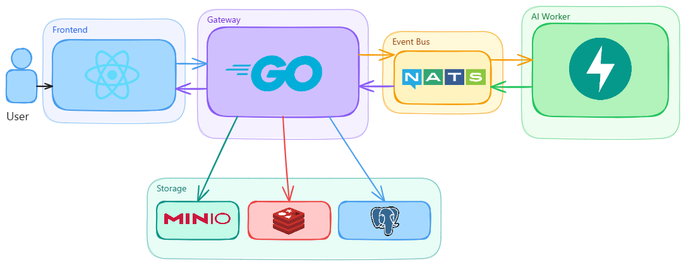

**Transform your photos into anime art**

 

## Overview

Animoji is an AI-powered platform that turns ordinary photos into anime-style artwork and expressive emoji variants. Users upload a photo, an AI pipeline enhances the generation prompt and produces the image  

Users can also fans out into  emotion-specific emoji stickers, then they can preview the result and decide whether to publish it.

The platform is evolving into a social experience, users authenticate via Google OAuth, manage their own gallery with public or private visibility, and browse a live community feed of published creations.

**Core capabilities**

- Photo to anime transformation using FLUX.2-pro
- Emoji-style variant generation (multiple emotional expressions per photo)
- Real-time job streaming over SSE while generation runs
- Publish-on-demand workflow, previews never persist unless the user chooses
- Community feed with public/private visibility controls
- Google OAuth authentication with JWT session management

---

## Architecture

**System Architecture**

Animoji is built as three independent tiers connected by well-defined boundaries. Users interact exclusively through the **React web app**, which talks to the **Go API Gateway** for all CRUD operations and receives live generation updates back over a persistent **Server-Sent Events** stream. The Gateway owns all application logic, it authenticates requests, writes uploads to **MinIO**, caches job state in **Redis**, and persists published images in **PostgreSQL**. Generation work is handed off asynchronously: the Gateway publishes a job event onto **NATS**, decoupling itself entirely from the AI pipeline. The **FastAPI AI Worker** subscribes independently, runs prompt enhancement and FLUX.2-pro image synthesis, then publishes a status event back through NATS once the result is stored. The Gateway picks up that event and forwards it to the waiting browser via SSE.

---

## Features

### Anime Generation
Upload any photo and receive a high-quality anime-style rendering. The AI worker first enhances your description through a prompt agent before sending it to FLUX.2-pro, producing stylistically consistent results rather.

### Emoji Variant Generation
A single photo produces emoji-style variants, each capturing a different emotional expression. Variants are generated in parallel and streamed to the client as they complete. Background is automatically removed, returning transparent PNGs ready for use anywhere.

### Real-time Job Streaming
Generation status is pushed to the client over Server-Sent Events. The gateway subscribes to NATS status subjects and forwards updates as they arrive, the browser receives progress and the final result URL the moment generation completes.

### Publish-on-demand Gallery
Temporary results are never persisted automatically. Users preview first, then choose whether to publish and with what visibility (public or private). Unpublished results expire automatically after 24 hours via MinIO lifecycle management.

### Community Feed
Published public images appear in a shared community feed. Users can maintain a personal gallery of their own creations.

### Authentication
Google OAuth 2.0 handles sign-in. The gateway issues RS256-signed JWTs validated on every protected route.

---

## Technologies

| Layer | Technology | Role |
|---|---|---|
| Frontend | React 19 + TypeScript | Single-page application, SSE streaming, Redux Toolkit state |
| Gateway | Go + chi | REST API, auth middleware, MinIO/Redis/NATS orchestration |
| AI Worker | Python + FastAPI | NATS consumer, prompt agent, image generation pipeline |
| Prompt AI | pydantic-ai | Structured prompt enhancement before image generation |
| Image Generation | FLUX.2-pro | High-quality anime and emoji image synthesis |
| Message Bus | NATS | Decoupled job dispatch and status fan-in |
| Object Storage | MinIO | Photo uploads, generated results, thumbnails |
| Cache | Redis | Job metadata with 24-hour TTL |
| Database | PostgreSQL | Persisted image and user records (published only) |
| Auth | Google OAuth 2.0 | User identity and session management |
| Reverse Proxy | Nginx | Request routing, static asset serving |
| Container | Docker Compose | Full-stack local orchestration |
