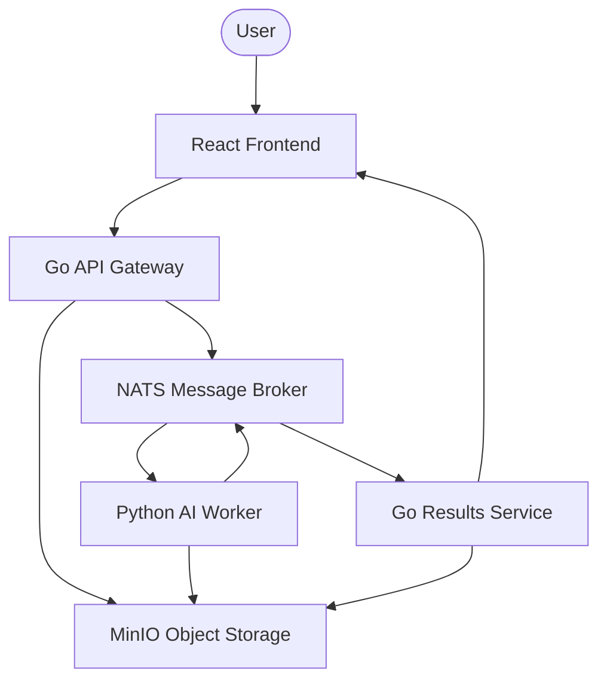
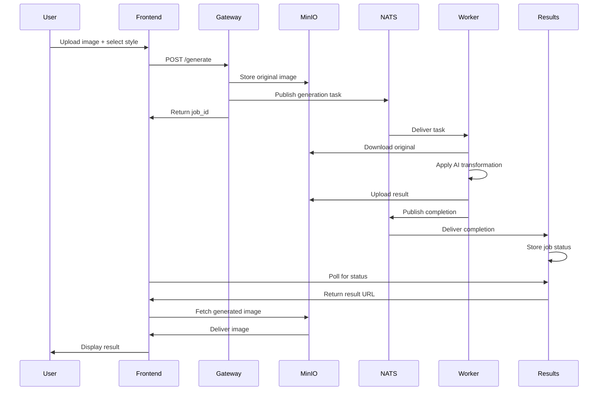
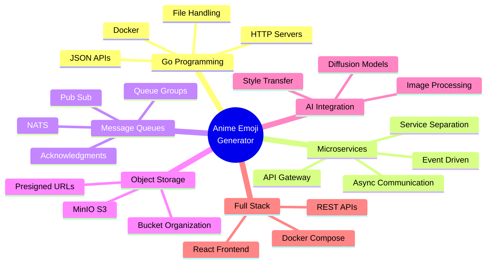

# Anime Emoji Generator — Project Overview

## What You're Building

A complete microservices application that transforms user photos into anime-style images using AI. Users upload an image, select an anime style, and receive AI-generated anime versions.

---

## Architecture



---

## System Components

| Component | Purpose | What It Does |
|-----------|---------|--------------|
| **React Frontend** | User Interface | Upload images, select styles, display results |
| **Go API Gateway** | Entry Point | Receives requests, coordinates services |
| **NATS** | Message Bus | Enables async communication between services |
| **MinIO** | File Storage | Stores original and generated images |
| **Python AI Worker** | Image Processing | Transforms images to anime style using AI |
| **Go Results Service** | Status Tracking | Monitors jobs, provides status updates |

---

## How It Works


4. **Python Worker** → Receives job, downloads from MinIO
5. **Python Worker** → Runs AI model, generates anime image
6. **Python Worker** → Uploads result to MinIO (`generated/`)
7. **Python Worker** → Publishes completion to NATS (`anime.generated`)
8. **Go Results Service** → Stores job metadata in SQLite
9. **React polls** → Gets presigned URL, displays result

---

## Message Schemas

### GenerationTask (anime.generate)

```json
{
  "job_id": "uuid-v4",
  "input_key": "originals/uuid/input.jpg",
  "prompt": "anime style, studio ghibli",
  "style": "ghibli",
  "created_at": "2025-01-15T10:30:00Z"
}
```

### GenerationResult (anime.generated)

```json
{
  "job_id": "uuid-v4",
  "status": "completed",
  "output_key": "generated/uuid/result.png",
  "error": null,
  "completed_at": "2025-01-15T10:30:45Z"
}
```

---

## MinIO Bucket Structure

```
animoji-images/
├── uploads/           # Raw uploads (temporary)
│   └── {job_id}.{ext}
├── originals/         # Validated originals
│   └── {job_id}/
│       └── input.{ext}
├── generated/         # AI outputs
│   └── {job_id}/
│       └── result.png
└── thumbnails/        # Preview images (optional)
    └── {job_id}/
        └── thumb.jpg
```

---

## Supported Anime Styles

| Style | Model/LoRA | Description |
|-------|------------|-------------|
| Generic Anime | Anything-V5 | General anime look |
| Studio Ghibli | Ghibli LoRA | Soft, painterly Ghibli style |
| One Piece | OP LoRA | Bold, exaggerated features |
| Demon Slayer | DS LoRA | Sharp, dramatic style |
| Chibi | Chibi LoRA | Cute, super-deformed |

---

---

## Learning Path

### **Phase 1: Go Fundamentals (Days 1-3)**
Build a simple Go application to learn the basics.

**What you'll build:**
- Command-line tool to read image metadata
- HTTP API for file uploads
- Docker container for your API

**Key concepts:**
- Go syntax and error handling
- HTTP servers and routing
- JSON handling
- Docker basics

---

### **Phase 2: Object Storage (Days 4-5)**
Learn to store and retrieve files using MinIO.

**What you'll build:**
- MinIO integration in your Go API
- File upload to object storage
- Presigned URLs for secure downloads

**Key concepts:**
- Object storage (buckets, keys)
- S3-compatible APIs
- Temporary access URLs

---

### **Phase 3: Message-Driven Architecture (Days 6-7)**
Introduce async communication between services.

**What you'll build:**
- NATS message broker setup
- Publisher in Go API
- Consumer service in Go

**Key concepts:**
- Pub/Sub messaging
- Async communication
- Message queues
- Decoupling services

---

### **Phase 4: AI Worker Service (Days 8-9)**
Build the Python service that processes images.

**What you'll build:**
- Python worker consuming messages
- AI model integration (anime style transfer)
- Image processing pipeline

**Key concepts:**
- Cross-language microservices
- AI/ML model deployment
- Image transformations

---

### **Phase 5: Results Tracking (Day 10)**
Create a service to track job status.

**What you'll build:**
- Go service subscribing to completion events
- Database for job metadata
- REST API for status queries

**Key concepts:**
- Event-driven architecture
- Database integration
- Service coordination

---

### **Phase 6: User Interface (Days 11-12)**
Build the frontend for users to interact with.

**What you'll build:**
- React application
- Image upload interface
- Style selector
- Result display with polling

**Key concepts:**
- File upload from browser
- API integration
- Async state management
- Polling for updates

---

### **Phase 7: Complete Integration (Days 13-14)**
Connect all services and deploy locally.

**What you'll build:**
- Docker Compose for all services
- Service orchestration
- Health checks
- End-to-end testing

**Key concepts:**
- Multi-service deployment
- Service dependencies
- Container networking
- System debugging

---

## What You'll Learn



---

## Project Timeline

| Week | Focus | Outcome |
|------|-------|---------|
| **Week 1** | Go basics + Storage | Working API with file uploads |
| **Week 2** | Microservices + AI | Complete backend with image processing |
| **Week 3** | Frontend + Integration | Full application running locally |

---

## Prerequisites

- Basic programming knowledge (any language)
- Docker installed on your machine
- Enthusiasm to learn!

**Optional but helpful:**
- Go tutorial completed
- Familiarity with REST APIs
- Basic understanding of Docker

---

## Getting Started

Ready to begin? Start with **[Phase 1: Go Fundamentals](./01-go-fundamentals.md)**

Each phase includes:
- Clear learning objectives
- Step-by-step implementation guide
- Code examples
- Exercises to reinforce learning
- Checklist before moving forward
